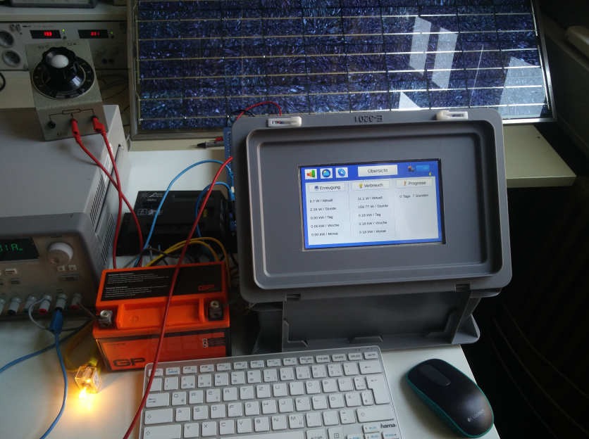

<h2>Monitoring System for Autonomous Plants</h2>

(Private project during my technician school STB)
The project is based on Python using a Single-board Computer (Raspberry Pi) with a touchscreen and some
extra components like relays and sensors. A custom user interface (GUI) was designed. The system monitors
generation and consumption, makes a forecast of the remaining time and controls multiple circuits.
Furthermore, the system also retrieves real-time weather data (OpenWeatherMap) to generate a more accurate
forecast.

Full documentation read here: <a href="Projekt_dokumentation.pdf" target="_blank">-project documentation-</a>

Example how the forecast looks like: 

Snapshot from the Lab 

